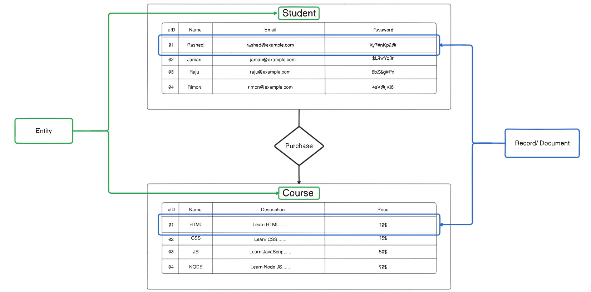
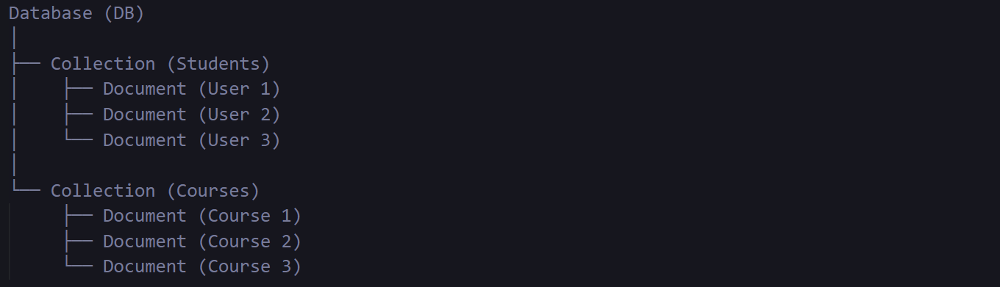
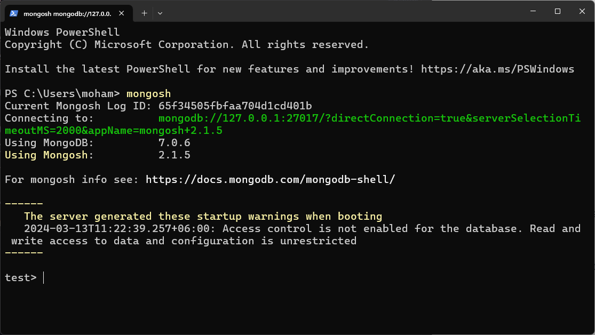
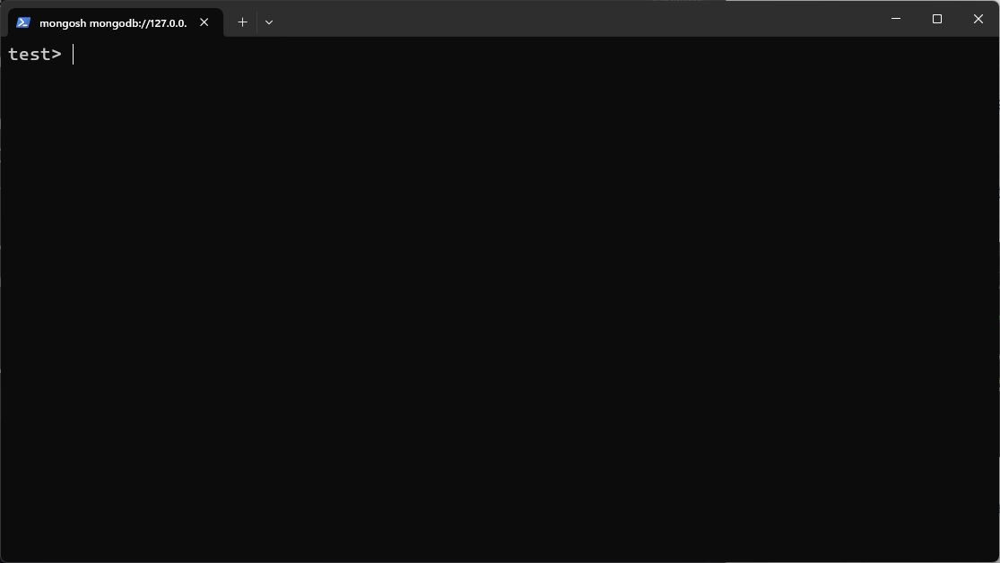
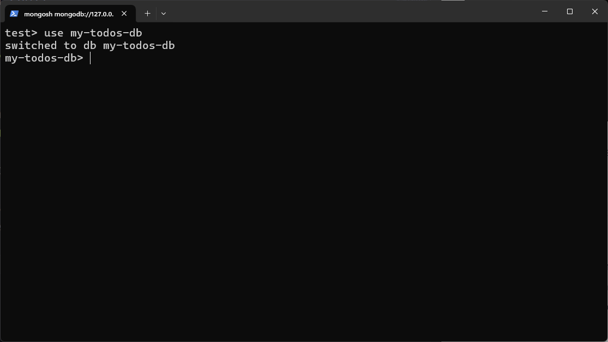
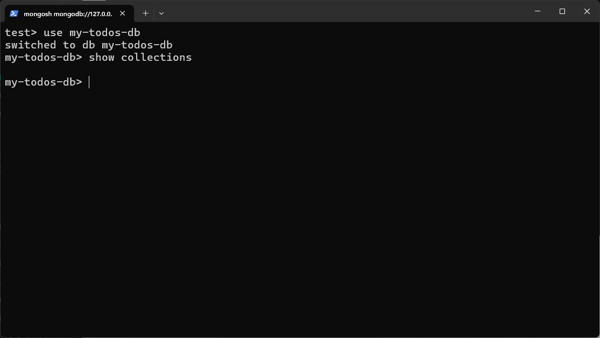
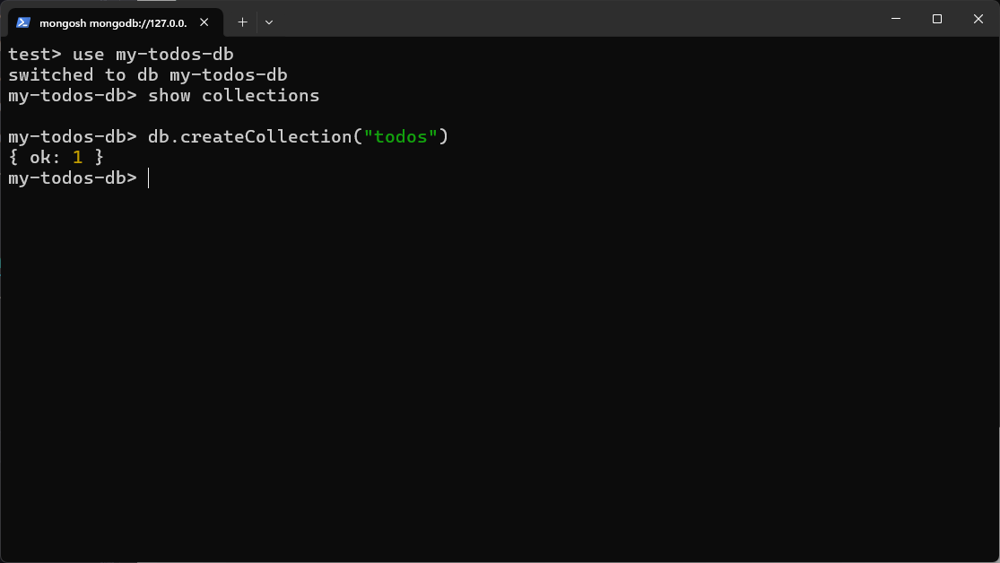
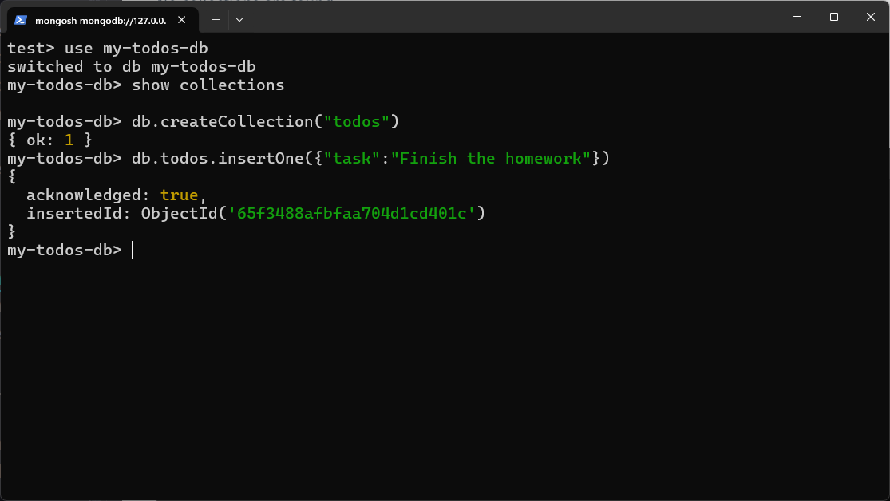
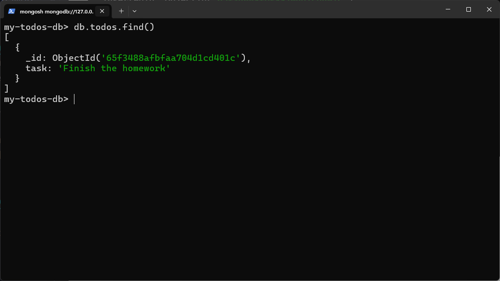

# Record
When we visualize an entity in a tabular form, each row in the table represents a single record or instance of that entity

# Document 
An entity contains multiple number of record/document within a table like structure.

In **MongoDB** each record present within entity table is a document, which is a data structure composed of **field (In ER Diagram this is => Attribute)** and **value** pairs. **MongoDB** documents are similar to JSON objects.
**Example of record in below:**<br>
### IN JSON FORMAT
```json
{
        "uID":4,                         
        "name":"Rimon",            
        "email":"rimon@gmail.com",    
        "password":"4sV@jK!8"         
}
```
### IN JSOLN FORMAT
```json
{
    uID:1,                         
    name:"Rashed",              
    email:"rashed@gmail.com",   
    password:"Xy7#nKp2@"        
}
```
# Collection


A collection is a **group** of multiple JSON-formatted records/documents belonging to a specific entity.

By wrapping all existing JSON-formatted records/documents belonging to a specific entity within an array, we create a collection.


**Example of collection below:**
```json
[
    {
        "uID": 1,
        "name": "Rashed",
        "email": "rashed@gmail.com",
        "password": "Xy7#nKp2@"
    },
    {
        "uID": 2,
        "name": "Jaman",
        "email": "jaman@gmail.com",
        "password": "$L9wYq3r"
    },
    {
        "uID": 3,
        "name": "Raju",
        "email": "raju@gmail.com",
        "password": "6bZ&g#Px"
    },
    {
        "uID": 4,
        "name": "Rimon",
        "email": "rimon@gmail.com",
        "password": "4sV@jK!8"
    }
]
```

# Database

**What is a Database?** 
- Think of a database like a big box where you keep smaller boxes. Each smaller box holds things that are related to each other, like clothes in a drawer.
- It's also like a big bookshelf where each shelf (collection) holds books (documents) on a similar topic.

**Why Do We Need Databases?** 
- They help us keep our stuff organized. Instead of scattering items all over the place, we can group them together neatly.
- Just like how folders on your computer help you find files quickly, databases help us find information efficiently.

**Key Points:**
- **Database:** It's a big box (or bookshelf) holding smaller boxes (or shelves) where we keep related things (or documents).
- **Collections:** These are the smaller boxes (or shelves) inside the big box (or bookshelf), organizing similar items together.
- Databases make it easy to manage and find information when it's all neatly organized.


**Example of DB below:**
```json
[
    [
        {
            "uID": 1,
            "name": "Rashed",
            "email": "rashed@gmail.com",
            "password": "Xy7#nKp2@"
        },
        {
            "uID": 2,
            "name": "Jaman",
            "email": "jaman@gmail.com",
            "password": "$L9wYq3r"
        },
        {
            "uID": 3,
            "name": "Raju",
            "email": "raju@gmail.com",
            "password": "6bZ&g#Px"
        },
        {
            "uID": 4,
            "name": "Rimon",
            "email": "rimon@gmail.com",
            "password": "4sV@jK!8"
        }
    ],
    [
        {
            "cID": 1,
            "name": "HTML",
            "description": "Learn HTML.......",
            "price": "10$"
        },
        {
            "cID": 2,
            "name": "CSS",
            "description": "Learn CSS.......",
            "price": "15$"
        },
        {
            "cID": 3,
            "name": "JS",
            "description": "Learn JavaScript.....",
            "price": "50$"
        },
        {
            "cID": 4,
            "name": "NODE",
            "description": "Learn Node JS......",
            "price": "90$"
        }
    ]
]
```
## Input Format: JSON

For storing new record/document in database first we need to input the new record/document in JSON format
## Storage Format: BSON (Binary JSON)

After we provide input as a new record in JSON format, MongoDB stores the record in BSON format.

**BSON (Binary JavaScript Object Notation)** is a binary representation of JSON data. MongoDB internally converts the JSON input into BSON before storing it in binary format within the database.

### Key Points
- MongoDB takes input records/documents in JSON format.
- Before storing, MongoDB converts JSON to BSON implicitly.
- BSON format is only understanable by machine
- BSON allows for efficient storage and retrieval of data.
- MongoDB utilizes BSON to enable fast querying and manipulation of documents.

# CRUD operation on MongoDB
C => Create
R => Read
U => Update
D => Delete

### Project TODO
Steps:
1. Create Database
2. Create Collection of tasks
3. Todos -> CRUD
   
Open CMD or Terminal then type `mongosh` as a command to run mongosh shell

        
Press `Ctrl+L` to clear all unwanted info


For creating new database use below command
`use dbname`
if entered db exist then the existing database will be opened in terminal

if there is no database existing in that name then mongosh will create a new database<br>
Creating a database **my-todos-db**

The my-todos-db named database created successfully and opened in the terminal

check is that the database contains any collections
use this command
`show collections`

No collections are found

create new collection
`db.createCollection("collectionName")
`
db indicates => my-todo-db named Database

**{ok:1}** means todos collection created successfully

insert or add task to todos collection


see all records present in todos collection using `db.todos.find()`

here mongodb automatically insterted a new _id when added or inserted new task
So we dont need to add explicitly any id


Practice: 
1) check how many collections present in this db.
2) add another task in todos collection
3)  Check all task in todos collection
